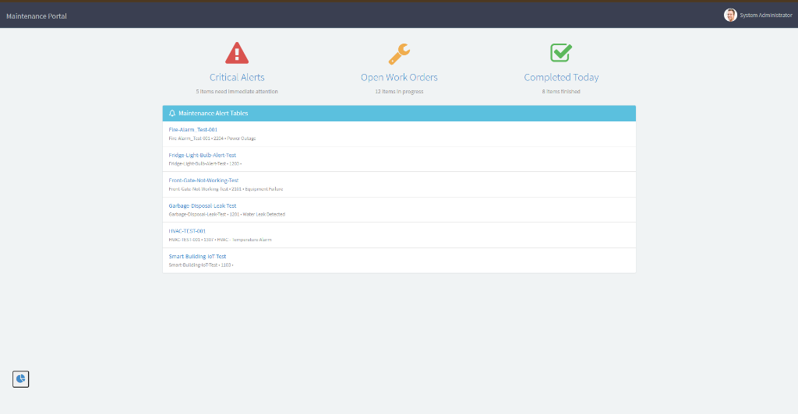
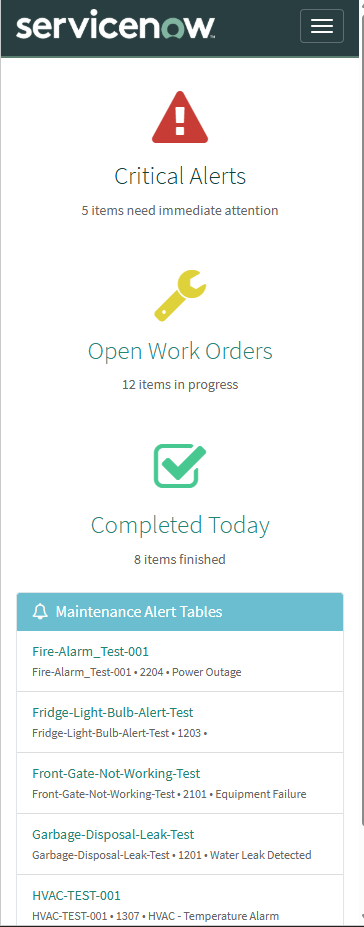
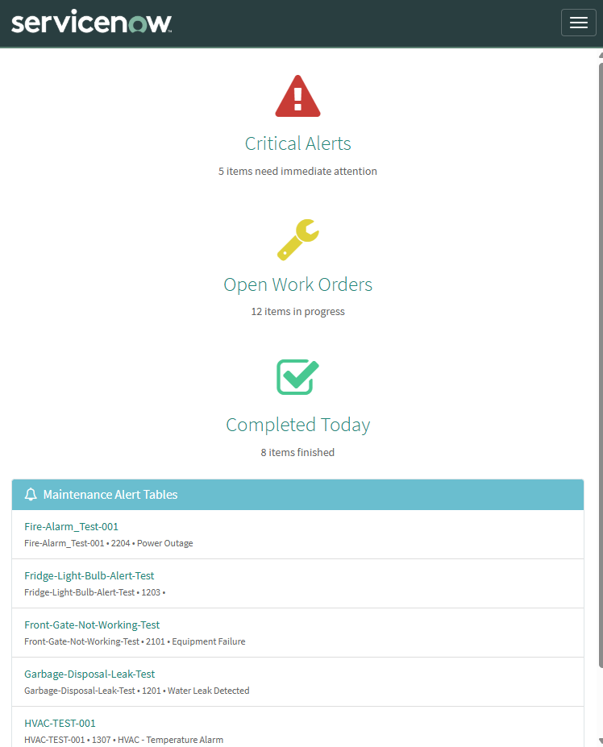

# Mobile Maintenance Portal

Designed and delivered a mobile-responsive Service Portal to provide field maintenance staff with real-time access to work assignments and critical alerts on any device. Built using Service Portal framework with touch-optimized UX to eliminate office dependency and enable on-site status updates.

**Business Value:** Eliminates office trips for work assignments, enables real-time status updates from job sites, provides mobile access to critical alerts, and improves data quality through field-accessible forms.

---

## Business Problem

**Before:**
- Field technicians required office visits to check work assignments
- Desktop-only interface unusable on mobile devices
- Status updates delayed until technicians returned to office
- No mobile access to critical alerts or equipment information
- Poor data compliance due to inability to update records from field

---

## Solution Delivered

**Mobile-First Service Portal:**
- Built custom Service Portal with mobile-responsive design
- Created visual metric dashboard cards:
  - Critical Alerts (red warning icon)
  - Open Work Orders (yellow wrench icon)
  - Completed Today (green checkmark icon)
- Configured maintenance alert feed with real-time data
- Implemented responsive layout:
  - Desktop: 3-column metric grid
  - Mobile: Stacked vertical cards
- Designed for touch interaction (44px minimum touch targets)
- Used high-contrast colors for outdoor visibility

---

## Business Value

**What the System Does:**
- **Eliminates office dependency** by providing mobile access to work assignments
- **Enables field status updates** through mobile-accessible forms
- **Provides situational awareness** via at-a-glance metric cards
- **Improves data quality** by allowing real-time updates from job sites
- **Reduces response time** through mobile access to critical alerts

---

## Technical Highlights

**ServiceNow Features Used:**
- **Service Portal:** Custom portal with responsive theme
- **Portal Designer:** Drag-and-drop page builder
- **Icon Link Widgets:** Visual metric cards with color/icon configuration
- **Simple List Widget:** Real-time alert feed with filtering
- **Bootstrap 4:** Responsive grid system (12-column layout)
- **Data Sources:** GlideRecord queries to maintenance tables

**Configuration Details:**
- Portal Name: Maintenance Portal
- Homepage: Maintenance Home
- Layout: 3-column grid (col-md-4) for responsive stacking
- Color coding: Bootstrap classes (Danger, Warning, Success)
- Target personas: Field technicians, HVAC specialists, plumbers, electricians

---

## Screenshots

### Desktop Dashboard View
  
*Three-column metric layout with color-coded status cards and maintenance alert feed*

### Mobile Metric Cards
  
*Touch-optimized status cards stacked vertically for mobile devices with high-contrast colors*

### Complete Mobile Experience
  
*Full portal showing metric cards and scrollable alert list on mobile device*

---

## Setup Notes

**Environment:** ServiceNow Personal Developer Instance (Zurich Release)

**Prerequisites:**
- Service Portal plugin activated
- Maintenance Alert table (from Alert Processing System)

**Setup Steps:**
1. Create new Service Portal ("Maintenance Portal")
2. Create homepage ("Maintenance Home")
3. Add container with 3-column layout (4-4-4 grid)
4. Insert Icon Link widgets:
   - Widget 1: Critical Alerts (red, warning icon)
   - Widget 2: Open Work Orders (yellow, wrench icon)
   - Widget 3: Completed Today (green, checkmark icon)
5. Add Simple List widget for alert feed
6. Configure data sources and filters
7. Test responsive behavior (desktop → mobile)

---

## Technologies

- ServiceNow Service Portal
- Portal Designer
- Icon Link Widgets
- Simple List Widgets
- Bootstrap 4 (CSS Framework)
- AngularJS (Portal Framework)
- GlideRecord API (Data Sources)

---

## Related Projects

Integrates with [Alert Processing System](../project3_api_integration) for real-time alert feed data.

---

**Built on ServiceNow Service Portal Framework (Zurich Release)**
